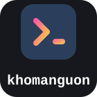

# khomanguon — Brand Guide

Tài liệu thương hiệu cho v2: logo, slogan, mô tả, màu sắc, typography và quy tắc sử dụng. Xây trên đúng bản sắc thị giác đã khảo sát từ v1 (mục 02 [`docs/khomanguon-v2-spec.html`](docs/khomanguon-v2-spec.html)) — không đổi tông, chỉ hệ thống hoá lại cho nhất quán.

---

## 1. Định vị thương hiệu

**khomanguon** là kho lưu trữ & chia sẻ mã nguồn game/web/app cho cộng đồng Việt — nơi những người từng lớn lên cùng CS Online, Hiệp Khách Giang Hồ, Võ Lâm Truyền Kỳ, Cabal, Con Đường Tơ Lụa... quay lại **tự tay dựng server riêng** để sống lại những tựa game đó, thay vì chỉ hoài niệm suông.

Ba trụ cột định vị:

| Trụ cột | Ý nghĩa |
|---|---|
| **Kho** | Không phải một bài đăng đơn lẻ — là kho lưu trữ có tổ chức, phân loại rõ, tồn tại lâu dài. |
| **Mã nguồn** | Tinh thần kỹ thuật, tự tay build, không phải "mua sẵn dùng ngay" — dành cho người muốn hiểu & tự dựng. |
| **Hoài niệm** | Đối tượng chính là người có ký ức với các game online Việt Nam giai đoạn 2003–2015 — thứ khiến cộng đồng này khác biệt với các diễn đàn source code chung chung. |

**Đối tượng:** Lập trình viên nghiệp dư/chuyên nghiệp, admin private server, và game thủ hoài cổ muốn tự vận hành lại tựa game tuổi thơ.

**Giọng điệu (tone of voice):** Thân thiện kiểu "anh em cùng đam mê" (xưng hô "anh em", "mình"), kỹ thuật nhưng không hàn lâm, hoài niệm nhưng không sến — giống cách v1 mở đầu mỗi bài viết ("Xin chào tất cả các bạn...", "Anh em là fan cứng của...").

---

## 2. Slogan

**Khuyến nghị:**

> ### Mở kho, dựng lại thanh xuân.

Ngắn, hai động từ chủ động ("mở", "dựng" — đúng hành vi thật: mở kho mã nguồn, dựng server), không sến nhưng vẫn chạm cảm xúc hoài niệm.

**Phương án khác** (dùng tuỳ ngữ cảnh — banner sự kiện, mạng xã hội, trang danh mục cụ thể):

| Slogan | Phù hợp dùng ở đâu |
|---|---|
| Mở kho, dựng lại thanh xuân. | Trang chủ, logo lockup, banner chính |
| Nơi mã nguồn cũ có đời sống mới. | Trang danh mục game offline/private server |
| Chạm vào mã nguồn, chạm lại tuổi thơ. | Bài viết, mạng xã hội, nội dung cảm xúc |
| Kho mã nguồn cho người thích tự tay dựng. | Trang giới thiệu kỹ thuật, README, developer-facing |

Tránh dùng nhiều hơn 1 slogan trên cùng một trang — chọn đúng slogan theo ngữ cảnh, không xếp chồng.

---

## 3. Mô tả (Description)

### Elevator pitch (1 câu)
> khomanguon là kho mã nguồn game, web và app cho cộng đồng Việt — nơi bạn tải, tự dựng server và sống lại những tựa game một thời.

### Meta description (SEO, ≤160 ký tự)
> Kho mã nguồn Game/Web/App lớn nhất cho cộng đồng Việt — tải server offline, VM 1-click, tool GM, kèm ví $P nạp tự động qua SePay.
*(155 ký tự — dùng cho thẻ `<meta name="description">` trang chủ, xem UC15)*

### Đoạn giới thiệu (trang About / footer dài)
> khomanguon là nơi lưu trữ và chia sẻ mã nguồn game, website và ứng dụng dành cho cộng đồng lập trình viên và game thủ Việt Nam. Từ những server private offline của Hiệp Khách Giang Hồ, Võ Lâm Truyền Kỳ, CS Online đến các webgame và công cụ GM, mọi thứ được đóng gói sẵn, có hướng dẫn cài đặt và tải qua hệ thống an toàn. Đăng ký tài khoản, nạp ví **$P**, và bắt đầu dựng lại tựa game tuổi thơ theo cách của riêng bạn.

### Bio ngắn cho mạng xã hội (≤80 ký tự)
> Kho mã nguồn Game/Web/App cho cộng đồng Việt. Mở kho, dựng lại thanh xuân.

---

## 4. Logo

### Ý tưởng thiết kế

Biểu tượng là dấu nhắc lệnh **`>_`** (command prompt) đặt trong khối bo góc — vì đây là *mã nguồn*: mọi thứ trên site bắt đầu từ một dòng lệnh. Màu nền navy đặc trưng của v1, gạch chéo `>` và dấu gạch dưới `_` tô bằng gradient hồng–vàng — đúng gradient underline đã dùng ở tiêu đề bài viết v1 — để icon tự thân đã mang màu nhận diện, không cần thêm chi tiết.

Wordmark **`khomanguon`** viết thường toàn bộ (khớp domain), font monospace — cùng lý do: đây là một cái tên gõ ra, không phải viết hoa trang trọng.

### Các phiên bản file

| File | Dùng khi nào |
|---|---|
| [`brand/logo-mark.svg`](brand/logo-mark.svg) | Icon độc lập — favicon, avatar mạng xã hội, app icon. Nền tự chứa (navy), dùng được trên mọi nền. |
| [`brand/logo-monochrome.svg`](brand/logo-monochrome.svg) | Bản 1 màu (không gradient) — in ấn, dập nổi, hoặc nơi không hỗ trợ gradient. |
| [`brand/logo-horizontal.svg`](brand/logo-horizontal.svg) | Icon + wordmark, chữ navy — nền sáng (docs, giấy tờ, UI sáng). |
| [`brand/logo-horizontal-dark.svg`](brand/logo-horizontal-dark.svg) | Icon + wordmark, chữ trắng — navbar tối, nền navy/đen. |
| [`brand/logo-stacked.svg`](brand/logo-stacked.svg) | Bố cục dọc (icon trên, chữ dưới) — avatar vuông Discord/Facebook/GitHub org. |

<table>
<tr>
<td align="center" width="140">

`logo-mark`

</td>
<td align="center" width="140">

`logo-monochrome`

</td>
<td align="center" width="200">

`logo-stacked`

</td>
</tr>
</table>

`logo-horizontal` — dùng trên nền sáng

`logo-horizontal-dark` — dùng trên nền tối (navbar)

### Vùng an toàn & kích thước tối thiểu

- Chừa khoảng trống quanh logo tối thiểu bằng **chiều cao ký tự "k"** trong wordmark — không đặt chữ/icon khác chen vào vùng này.
- `logo-mark` không hiển thị dưới **16×16px** (favicon là giới hạn nhỏ nhất đã kiểm chứng — glyph `>_` vẫn đọc được ở cỡ này).
- `logo-horizontal` không co nhỏ hơn chiều cao **24px** — dưới mức này wordmark monospace vỡ nét.

### Không được làm

- Không đổi màu gradient của glyph `>_` sang màu khác ngoài cặp hồng–vàng đã định nghĩa.
- Không kéo giãn/bóp méo logo sai tỉ lệ khung (giữ nguyên viewBox gốc).
- Không đặt `logo-horizontal` (chữ navy) lên nền tối, hoặc `logo-horizontal-dark` (chữ trắng) lên nền sáng — luôn chọn đúng bản theo nền.
- Không thêm bóng đổ, viền, hiệu ứng 3D vào icon.
- Không viết hoa wordmark ("Khomanguon", "KHOMANGUON") — luôn viết thường.

### Ghi chú kỹ thuật

Wordmark trong các file trên dùng font-family hệ thống (`ui-monospace, SFMono-Regular, Menlo, Consolas, 'Courier New', monospace`) để không phụ thuộc font ngoài — nét chữ sẽ hơi khác nhau giữa macOS/Windows/Linux (chấp nhận được, đúng tinh thần "monospace"). Nếu cần logo cho in ấn/đối tác cần độ chính xác tuyệt đối về nét chữ, hãy convert text sang outline bằng công cụ vector (Illustrator/Figma/Inkscape) trước khi bàn giao.

---

## 5. Bảng màu

| Token | Hex | Dùng cho |
|---|---|---|
| Navy (accent chính) | `#1d3557` | Logo, tiêu đề, link, nút chính |
| Navbar tối | `#16181d` | Thanh điều hướng, nền tối |
| Gradient — điểm đầu | `#ff5da2` | Glyph logo, gạch chân tiêu đề, badge nổi bật |
| Gradient — điểm cuối | `#ffcf3f` | (đi kèm điểm đầu, luôn dùng theo cặp) |
| Nền sáng | `#ffffff` | Nền nội dung |
| Chữ phụ / muted | `#5c6370` | Meta text, caption |

Gradient hồng–vàng là **điểm nhấn duy nhất** — dùng cho chi tiết nhỏ (glyph, gạch chân, badge), không tô nền lớn hay dùng làm màu chữ chính. Xem đầy đủ palette trong mục 02 [`docs/khomanguon-v2-spec.html`](docs/khomanguon-v2-spec.html).

---

## 6. Typography

| Vai trò | Font stack | Dùng cho |
|---|---|---|
| Wordmark / nhãn kỹ thuật | `ui-monospace, SFMono-Regular, Menlo, Consolas, monospace` | Logo, permission key (`post.publish`), mã giao dịch, code block |
| Tiêu đề & nội dung | `-apple-system, "Segoe UI", Roboto, Helvetica Neue, Arial, sans-serif` | Heading, body text |

Monospace không chỉ dùng cho logo — dùng nhất quán ở mọi nơi hiển thị "dữ liệu kỹ thuật thật" (mã quyền, mã giao dịch $P, slug bài viết) để phân biệt trực quan với nội dung biên tập thông thường.

---

## 7. Áp dụng nhanh

- **Favicon:** xuất `logo-mark.svg` sang `.ico`/`.png` (32×32, 16×16).
- **README GitHub:** dùng `logo-horizontal.svg` ở đầu file (nền trắng GitHub).
- **Avatar Discord/Facebook/GitHub Org:** dùng `logo-stacked.svg`.
- **OG image mạng xã hội:** nền navbar tối `#16181d` + `logo-horizontal-dark.svg` căn giữa + slogan bên dưới bằng font sans.
